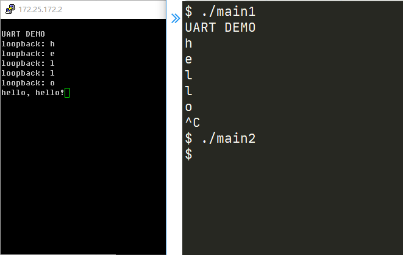

UART communication and a simple printf implementation example

**references**

1. https://github.com/plctlab/riscv-operating-system-mooc/blob/main/code/os/02-memanagement/printf.c
2. https://github.com/Digilent/linux-userspace-examples/blob/master/uart_example_linux/src/uart.c
3. https://www.programmersought.com/article/41014078945/
